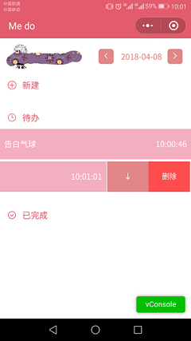
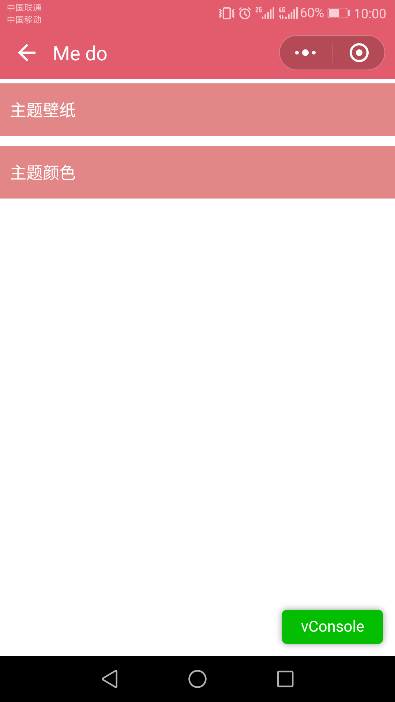
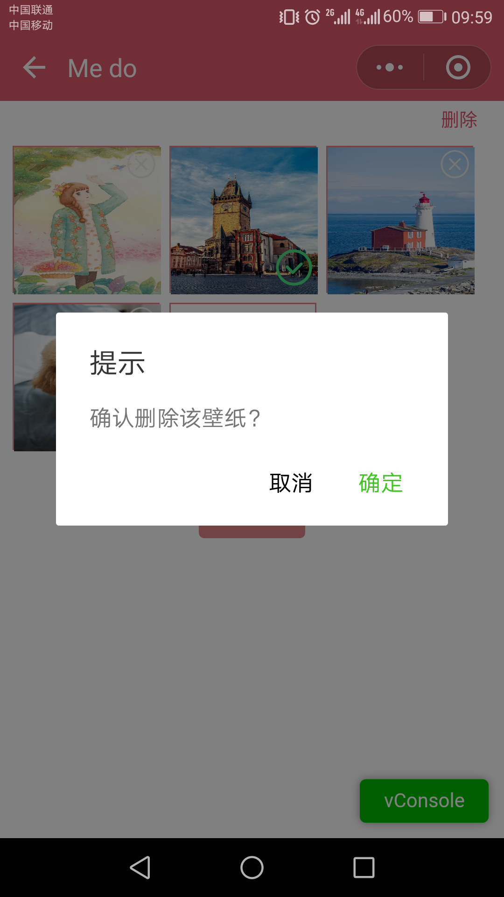
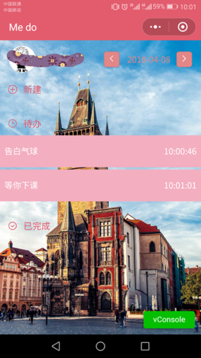

# Me do
微信小程序版 — todolist

### 首页
> 可进行添加事件等的操作



### 二级
> 用户授权后可进入


### 壁纸设置
> 壁纸的设置 、上传 、删除等



### 本地存储
* todolist
``` {
  date: '2018-04-01',
  list:[
    {
        time:'18:30:06',
        text:'能解决库存角度',
        state:'doing'
    },
    {
        time:'18:30:06',
        text:'能解决库存角度',
        state:'done'
    }
  ]
}
```
* wallpaper
```[
  {
    url: '../1.jpg',
    active: true,
    key: 'user'
  }
]